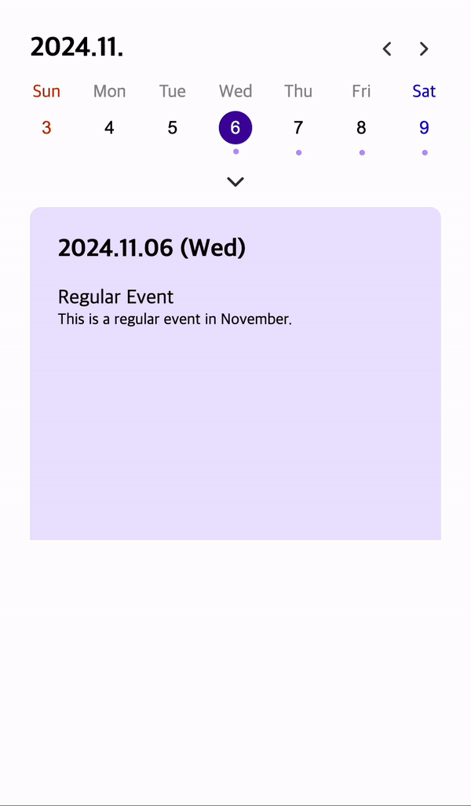

# react-fold-calendar

`react-fold-calendar` provides a calendar that can be swiped by month/week. <br/>
In particular, you can check the date by month/week by folding and unfolding the calendar.

<br/>



<br/>
<br/>

## options

| 1depth  | 2depth          | type                                | required | description                                                              |
| ------- | --------------- | ----------------------------------- | -------- | ------------------------------------------------------------------------ |
| options | data            | `IDataItem[]`                       | X        | schedule data                                                            |
|         | element         | `string` or `HTMLElement` or `null` | X        | When using the browser version, dom element to inject calendar           |
|         | useInitWeekType | boolean                             | X        | Whether to display as 'week' type when loading calendar                  |
|         | useShowContent  | boolean                             | X        | Whether to expose the content area by date at the bottom of the calendar |

<br/>
<br/>

## exports file

| file    | exports                            | description                                                                         |
| ------- | ---------------------------------- | ----------------------------------------------------------------------------------- |
| module  | `react-fold-calendar/module`       | It can be used by importing it as a module type.                                    |
| browser | `window.createReactFoldCalendar()` | After importing the browser.js file, you can call window.createReactFoldCalendar(). |
| css     | `calendar.css`                     | You can customize the design of your choice with the example style file.            |

<br/>
<br/>

## example

### module

```
import ReactFoldCalendar from "react-fold-calendar/module";
import "react-fold-calendar/css"; // css for reference

const App = () => {
  return <ReactFoldCalendar
        options={{
          useInitWeekType: true,
          useShowContent: true,
          data: [
            {
              startDate: new Date("2024/11/06 10:00")?.getTime(),
              endDate: new Date("2024/11/31 19:00")?.getTime(),
              period: 1,
              title: "Regular Event",
              description: "This is a regular event in November.",
            },
            {
              startDate: new Date("2024/11/15")?.getTime(),
              endDate: new Date("2024/11/31")?.getTime(),
              period: 3,
              title: "3-day event",
              description:
                "This event is held every three days from 11/15 to 11/31.",
            },
            {
              startDate: new Date("2024/11/18")?.getTime(),
              endDate: new Date("2024/11/18")?.getTime(),
              period: 0,
              title: "one day event",
              description: "The event is on November 18th.",
            },
          ],
        }}
      />;
}
```

<br/>
<br/>

### browser

```
<div id="app-browser"></div>

<script src="./browser.js"></script>
<script>
  document.addEventListener('DOMContentLoaded', () => {
    window.createReactFoldCalendar({
      useInitWeekType: true,
      useShowContent: true,
      element: '#app-browser',
      data: [
        { startDate: new Date('2024/10/01 10:00')?.getTime(), endDate: new Date('2024/10/31 19:00')?.getTime(), period: 1, title: '10월 이벤트', description: '10월 정기 이벤트 입니다.' },
        { startDate: new Date('2024/09/15')?.getTime(), endDate: new Date('2024/10/16')?.getTime(), period: 3, title: '9 ~ 10월 3일 이벤트', description: '9 ~ 10월 3일 단위 정기 이벤트 입니다.' },
        { startDate: new Date('2024/10/18')?.getTime(), endDate: new Date('2024/10/18')?.getTime(), period: 0, title: '10월 18일 이벤트', description: '반복 없은 10월 18일 이벤트입니다.' },
      ],
    });
  });
</script>
```

<br/>
<br/>

## etc.

- l10n provides `ko`, `en`. `en` is the default, except when the `html:lang` value is `ko`.
